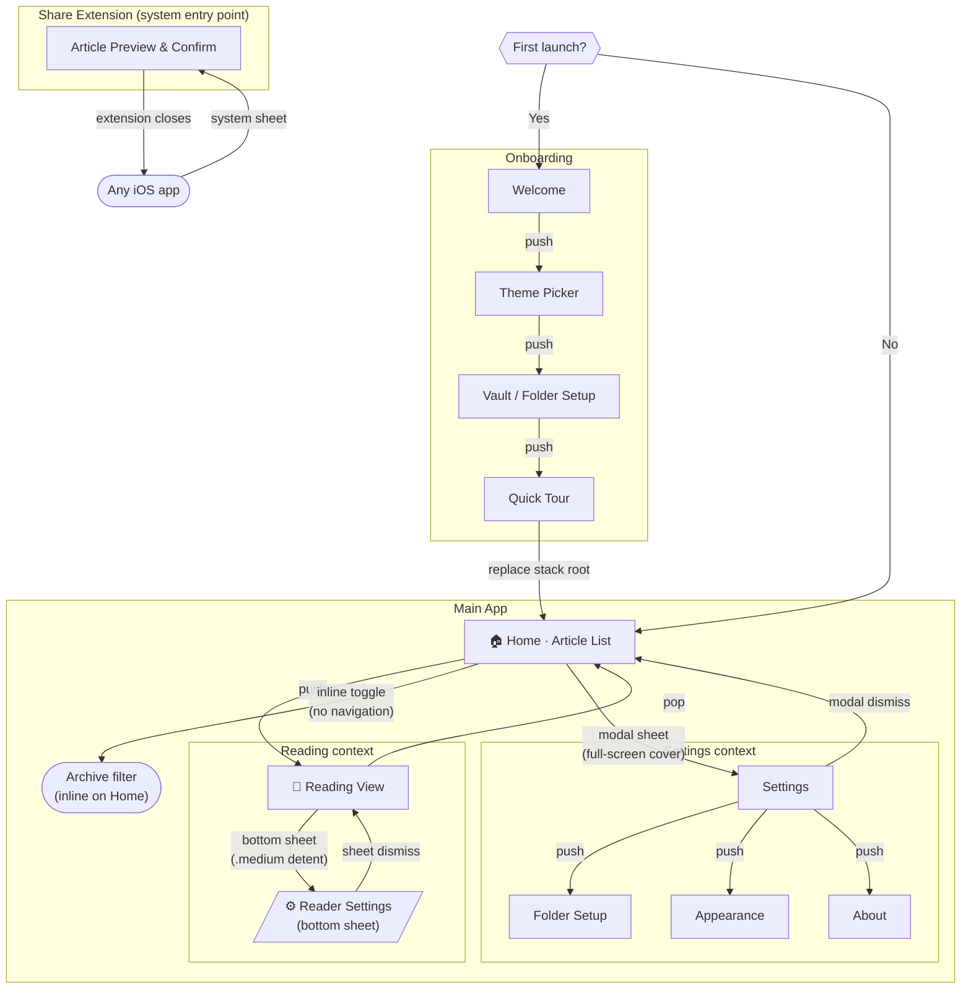

# Verso — Navigation Patterns

**FAB-63** · How the user moves between screens: the iOS navigation mechanics behind every transition.

> This document is a companion to [Site Map & Navigation Structure](site-map.md) (FAB-60) and [Primary User Flows](user-flows.md) (FAB-58). The site map defines *what* screens exist; this document defines *how* the user moves between them.

---

## Top-level decision: NavigationStack, no tab bar

Verso uses a single `NavigationStack` rooted at **Home**. There is no tab bar.

**Why not a tab bar?** A tab bar works well when an app has 3–5 peer destinations that users switch between frequently and independently. Verso has one primary destination (Home) and two supporting ones (Reading View, Settings). Settings is visited infrequently; Reading View is always entered *through* an article tap, not as an independent mode. A tab bar would add persistent chrome to an app whose core experience is distraction-free reading — it would also conflict with the immersive mode that hides all chrome.

---

## Navigation pattern diagram

Each arrow is annotated with its iOS transition type.

---

## Transition reference

| From | To | Transition | iOS pattern | Notes |
|------|----|-----------|-------------|-------|
| App launch | Onboarding OB-1 | Automatic | `NavigationStack` initial view | Only on first launch; persisted via `UserDefaults` |
| App launch | Home | Automatic | `NavigationStack` initial view | All subsequent launches |
| Onboarding OB-4 | Home | Replace stack root | `navigationDestination` path reset | Prevents back-swipe returning to onboarding |
| Home | Reading View | **Push** | `NavigationStack` push | Standard right-to-left slide |
| Reading View | Home | **Pop** | Back button / swipe-back gesture | Standard right-to-left reverse |
| Home | Settings | **Modal sheet** (full-screen cover) | `.fullScreenCover` | Full-screen because Settings contains a navigation stack of its own |
| Settings | Settings sub-pages | **Push** | `NavigationStack` push inside the modal | Folder Setup, Appearance, About each push within the Settings stack |
| Settings | Home | **Modal dismiss** | Swipe down or Done button | Swipe-to-dismiss enabled |
| Reading View | Reader Settings | **Bottom sheet** | `.sheet` with `.medium` detent | Slides up from the bottom edge; `.large` available if user drags up |
| Reader Settings | Reading View | **Sheet dismiss** | Swipe down or tap outside | Reading View stays in place underneath |
| Home | Archive filter | **In-place toggle** | State change, no navigation | Archive is a filtered view of the same list; no new screen is pushed |
| Any iOS app | Share Extension | **System share sheet** | `UIActivityViewController` + App Extension | Separate process; writes file to iCloud Drive, then closes |

---

## Key decisions explained

### Reader Settings as a bottom sheet, not a pushed screen

Presenting theme and font controls as a bottom sheet lets the user see the article *rerender in real time* as they change settings. If settings were a pushed screen, the article would be hidden during the interaction. The `.medium` detent keeps most of the article visible while the sheet is open.

### Settings as a full-screen modal, not a push

Settings contains its own sub-navigation (Folder Setup, Appearance, About), so it needs to host its own `NavigationStack`. Pushing a `NavigationStack` inside another is unsupported in SwiftUI. A `.fullScreenCover` gives Settings its own stack cleanly, and the swipe-to-dismiss gesture provides a natural exit.

### Archive as an inline filter, not a separate screen

Archived articles are a filtered state of the same list — they're not a distinct destination. Using a toggle rather than navigation avoids a back button that would feel redundant (the user is still on "Home"). This also keeps the mental model simple: one list, two views of it.

### Onboarding stack replacement

After the final onboarding screen (Quick Tour), the `NavigationStack` path is cleared and Home becomes the root. This prevents users from swiping back into onboarding after setup — which would be disorienting and could leave the folder configuration in an inconsistent state.

---

## Gestures and back navigation

| Gesture | Where available | Effect |
|---------|----------------|--------|
| Swipe right (edge) | Reading View | Pop back to Home |
| Swipe down | Settings modal | Dismiss Settings, return to Home |
| Swipe down | Reader Settings sheet | Dismiss sheet, return to Reading View |
| Swipe left on article | Home · Article List | Reveal archive action |
| Tap screen | Reading View | Toggle immersive mode (hide/show chrome) |

---

*Wireframes for each screen are in [/docs/wireframes](wireframes/). Navigation annotations on wireframes should reference the transition types defined in this document.*
