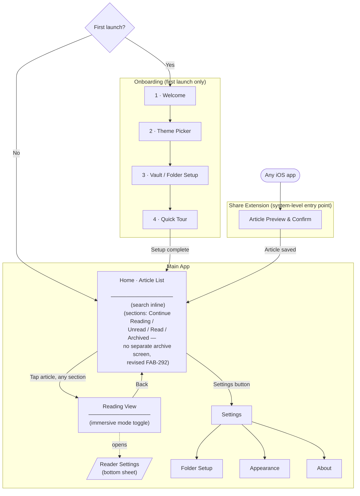

# Verso — Site Map & Navigation Structure

**FAB-60** · All MVP screens, their purpose, and how they connect. Required before wireframes.

---

## Navigation overview

Verso uses a single **NavigationStack** (no tab bar). The Home screen is the root. Settings and Reading View are pushed or presented from there. Search lives inline on the Home screen, not as a separate destination. This keeps the mental model simple: one place for your list, one place to read.

The **Share Extension** is a separate entry point — it runs outside the main app and writes directly to the iCloud Drive folder.

---

## Site map diagram

---

## Screens

### Onboarding

| # | Screen | Purpose |
|---|--------|---------|
| OB-1 | **Welcome** | Introduces Verso and its core concept (Markdown-first, iCloud-native). Sets expectations. First impression — must feel calm and confident. |
| OB-2 | **Theme Picker** | Lets the user choose their reading theme before they even open an article. Makes the app feel immediately personal. Choices: Paper (default), Sepia, Night, Ink. |
| OB-3 | **Vault / Folder Setup** | Prompts the user to select (or create) an iCloud Drive folder where articles will be saved. Obsidian users can point this at their vault. This is required to enable saving. |
| OB-4 | **Quick Tour** | A brief, scannable walkthrough of the 3 core actions: save via Share Sheet, read, archive. Skippable. Lands the user on Home when done. |

---

### Share Extension

| Screen | Purpose |
|--------|---------|
| **Article Preview & Confirm** | Appears as a sheet inside any iOS app when the user taps Share → Verso. Shows parsed title, estimated read time, and a thumbnail. Two actions: Save or Cancel. Writes the Markdown file to iCloud Drive on confirm. If no folder is configured, shows a prompt to open the main app instead. |

---

### Main App

| Screen | Purpose |
|--------|---------|
| **Home · Article List** | Root screen. Articles are grouped into always-visible sections rather than filtered by chips (revised FAB-292, 2026-08-29): **Continue Reading** (pinned first, shows live scroll-progress), **Unread**, **Read** (collapsed by default), **Archived** (collapsed by default). Empty sections are omitted entirely. Inline search filters by title and body content in real-time. A nav bar button opens Settings. Empty state when no articles are saved at all. |
| **Reading View** | Full-screen reading experience. Renders the Markdown article with the user's chosen theme and font. Opening an article automatically sets its status to **Reading** (if it was Unread). Tapping the screen hides/shows the chrome (immersive mode). Scrolling to the end sets status to **Read**. Back button returns to the list. |
| **Reader Settings** *(bottom sheet)* | Slides up from the Reading View. Controls: theme (Paper, Sepia, Night, Ink), font (New York, Georgia, San Francisco, OpenDyslexic), and text size. Changes apply immediately. Not a separate screen — it's a sheet anchored to the Reading View. |
| **Settings** | Top-level settings list. Entry point to sub-pages. Accessible from the nav bar on the Home screen. |
| **Folder Setup** *(Settings sub-page)* | Allows the user to change the iCloud Drive folder linked to Verso. Same interaction as OB-3, reachable any time after onboarding. If the user selects a different folder and articles already exist in the current one, Verso shows a dialog: *"Move your existing articles to the new folder? Your old folder won't be touched if you choose No."* |
| **Appearance** *(Settings sub-page)* | Default theme and font preferences — the values that Reading View opens with. Mirrors what was set in OB-2 and Reader Settings. |
| **About** *(Settings sub-page)* | App version, open-source acknowledgements, and a link to the project repository. |

---

## What's explicitly out of scope for MVP

- **Tag / folder browsing** — articles are one flat list (plus archive). No nested folders.
- **Reading list / queue** — no curated "up next" view.
- **Account / sync settings** — no user accounts; iCloud Drive handles sync automatically.
~~**Sharing from within the app** — no share button inside the Reading View for MVP.~~ Shipped since (FAB-299, 2026-08-31) — Share is in the Reading View's `⋯` overflow menu, not a persistent bottom control.
- **Notifications** — no read reminders or new article alerts.

---

*Next step: wireframes for each screen, starting with Home and Reading View.*
