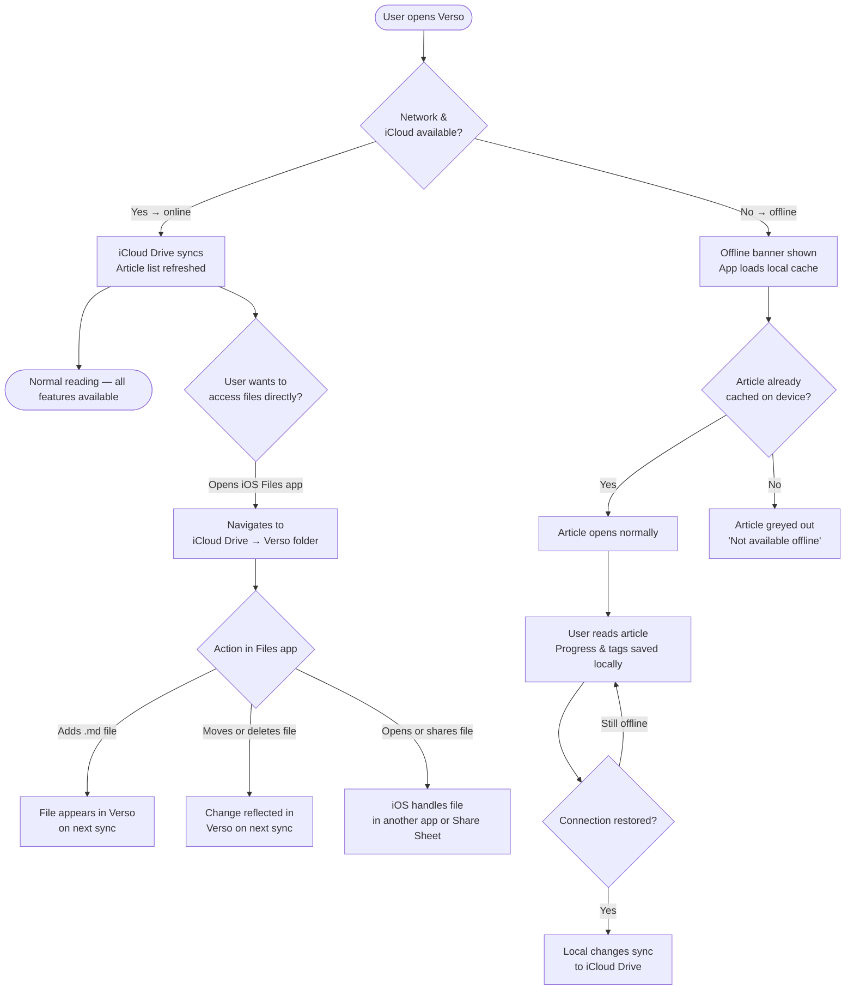
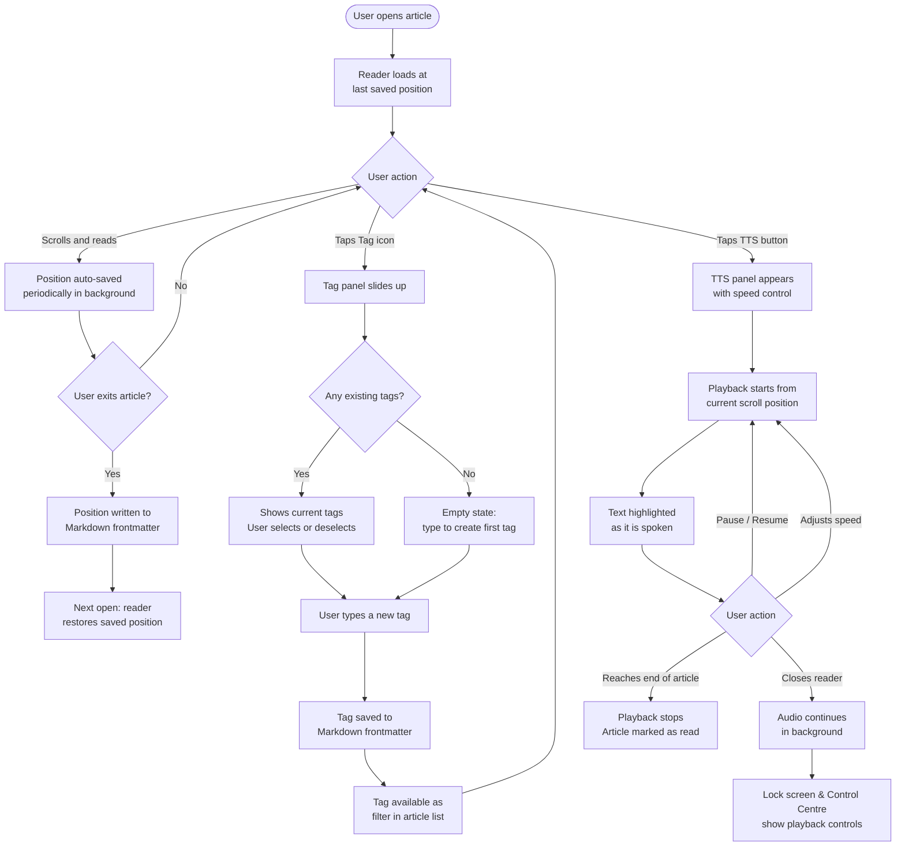

# Verso — Secondary User Flows

**FAB-59** · Flowcharts for secondary journeys: offline reading, iCloud Drive data access, tagging, progress saving, and text-to-speech.

---

## Flow 4 — Offline Reading & iCloud Drive Data Access

Two related flows that share the same underlying concern: how and where Verso's data lives. The first path covers what happens when the device loses connectivity; the second covers how a power user can access their Markdown files directly via the iOS Files app.

---

## Flow 5 — In-Reader Features: Tags, Progress Saving & Text-to-Speech

Three features available from within the article reader. All are optional and non-destructive — the user can ignore any of them and simply read.

---

*These flows cover the happy path and key decision points. Error states (e.g. iCloud sync conflicts, TTS engine unavailable, corrupted frontmatter) are deferred to a later detailed spec.*
