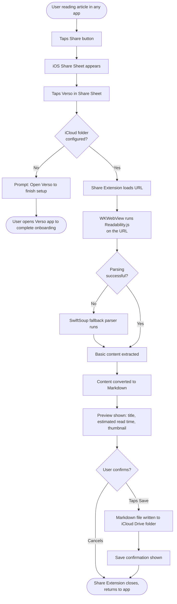
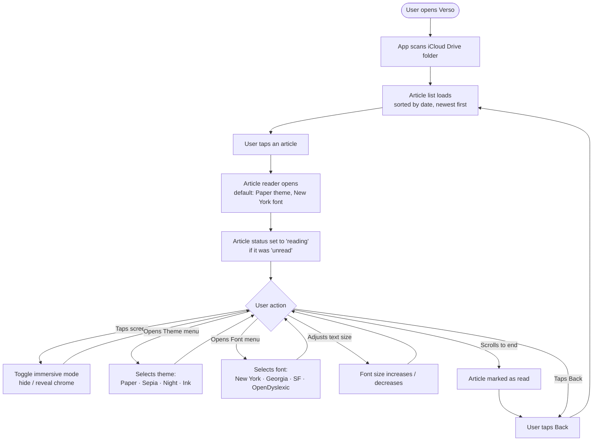
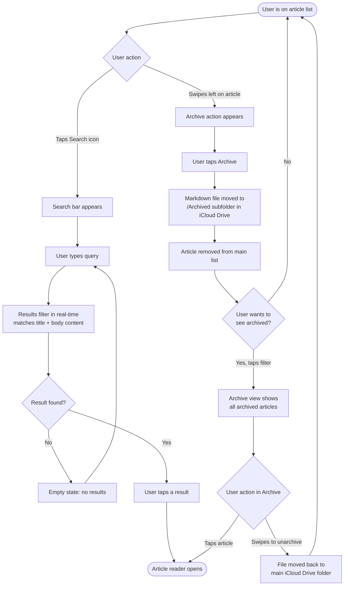

# Verso — Primary User Flows

**FAB-58** · High-level flowcharts for the 3 core journeys. Deliverable to unblock wireframing.

---

## Flow 1 — Save Article via Share Sheet

The user encounters an article in any app (Safari, Twitter/X, RSS reader, etc.) and sends it to Verso using the iOS Share Sheet.

---

## Flow 2 — Read Article with All Features

The user opens Verso and reads a saved article using available reading customisation options.

---

## Flow 3 — Archive and Search

Two related flows for managing the article library: finding articles via search and archiving articles the user no longer wants in the main list.

---

*These flows are intentionally high-level — they cover the main path and key decision points. Edge cases (network errors, corrupted files, permission denied) are deferred to a later detailed spec.*
